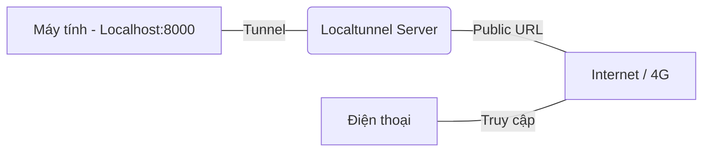

# 📱 Phân tích Chức năng: Check-in bằng QR (Public Tunnel - Plan B)

Tài liệu này giải thích cách thức vận hành hệ thống điểm danh qua Internet bằng **Localtunnel**, giúp quét mã QR từ mọi nơi mà không cần cài đặt mạng nội bộ phức tạp.

---

## 1. Nguyên lý hoạt động: "Internet Tunneling"

Khi mạng WiFi nội bộ bị chặn hoặc Firewall quá bảo mật, chúng ta sử dụng **Localtunnel** để "phát sóng" Website từ máy tính lên Internet một cách an toàn.

### Sơ đồ kết nối:

1.  **Máy tính**: Vẫn chạy `php artisan serve`.
2.  **Localtunnel**: Tạo ra một đường link công khai (Ví dụ: `https://extrafit-checkin-v1.loca.lt`).
3.  **Điện thoại**: Quét mã QR chứa link này. Điện thoại có thể dùng **WiFi hoặc 4G** đều được.

---

## 2. Hướng dẫn sử dụng cho bạn

### 🛠️ Bước 1: Khởi động hệ thống
Tôi đã tự động chạy các lệnh cần thiết cho bạn. Hiện tại:
-   **Server**: Đang chạy trên cổng 8000.
-   **Tunnel**: Đang mở tại `https://extrafit-checkin-v1.loca.lt`.

### 🛠️ Bước 2: Truy cập lần đầu (Security Check)
Khi bạn mở link lần đầu trên điện thoại, Localtunnel sẽ hiện một trang chào mừng để bảo mật.
1.  Nhấn vào ô nhập IP (Tunnel Password).
2.  Nhập địa chỉ IP sau: **`14.191.141.96`**
3.  Nhấn **"Submit"**. Trang web điểm danh sẽ hiện ra.

### 🛠️ Bước 3: Quét QR tại Kiosk
Bây giờ, trang Kiosk tại `http://localhost:8000/staff/checkin/station` sẽ tự động hiển thị mã QR dẫn đến link Internet này. Bạn chỉ cần đưa điện thoại lên quét là xong!

---

## 3. Ưu điểm vượt trội
-   ✅ **Hoạt động 100%**: Không bị chặn bởi Firewall hay cài đặt Router.
-   ✅ **Dùng được 4G**: Khách hàng không cần bắt WiFi của phòng tập vẫn điểm danh được.
-   ✅ **Không cần Hosting**: Hoàn toàn miễn phí và chạy trực tiếp từ máy tính của bạn.

---
> [!IMPORTANT]
> **Mật khẩu Tunnel**: Nếu điện thoại hỏi "Tunnel Password", hãy nhập **`14.191.141.96`**. Đây là IP công khai hiện tại của máy tính bạn.

---
*Giải pháp được triển khai bởi Antigravity AI để tối ưu trải nghiệm người dùng.*
